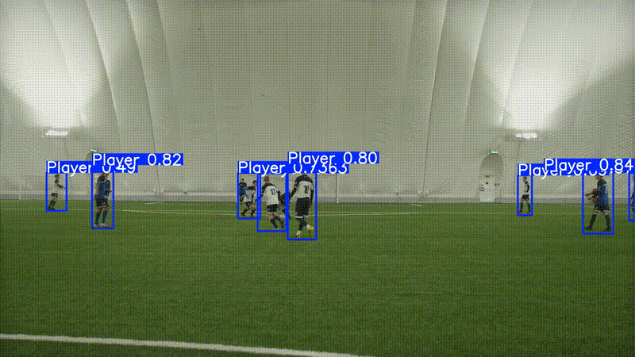

# ⚽ Football Player Detection with YOLO



Detección automática de **jugadores, balón y árbitros** en vídeo de fútbol utilizando un modelo **YOLOv8** entrenado sobre un dataset especializado.

Este proyecto implementa un flujo completo de Computer Vision:

* 📦 Preparación del dataset
* 🧠 Entrenamiento del modelo YOLO
* 📊 Evaluación con métricas estándar
* 🎥 Inferencia sobre vídeo real

---

## 🎯 Objetivo

Desarrollar un modelo capaz de detectar en escenas reales de fútbol:

* 👕 Jugadores
* ⚽ Balón
* 🧑‍⚖️ Árbitros

Con un enfoque práctico orientado a:

* Análisis deportivo
* Sistemas de tracking
* Aplicaciones reales de visión por computador en deportes

---

## 📚 Dataset

Se utilizó el dataset:

**Soccana Player–Ball–Referee Detection**

Clases:

```
0: Player
1: Ball
2: Referee
```

Estructura tras la preparación:

```
data/processed/
├── images/
│   ├── train/
│   ├── val/
│   └── test/
├── labels/
│   ├── train/
│   ├── val/
│   └── test/
└── data.yaml
```

---

## 🧠 Modelo utilizado

Modelo base:

```
YOLOv8n (Ultralytics)
```

Características:

* ⚡ Arquitectura ligera (~3M parámetros)
* 🚀 Optimizada para inferencia rápida
* 🌍 Preentrenada en COCO
* 🎯 Fine-tuning sobre dataset de fútbol

---

## 🏋️ Entrenamiento

```bash
yolo detect train \
  model=yolov8n.pt \
  data=data/data.yaml \
  epochs=20 \
  imgsz=640 \
  batch=32 \
  device=0
```

Configuración:

* Epochs: 20
* Tamaño de imagen: 640
* Batch size: 32
* Entrenamiento en GPU

---

## 📊 Resultados

| Clase      | Precision | Recall   | mAP50    | mAP50-95 |
| ---------- | --------- | -------- | -------- | -------- |
| Player     | 0.91      | 0.90     | 0.94     | 0.60     |
| Ball       | 0.77      | 0.45     | 0.51     | 0.25     |
| Referee    | 0.81      | 0.74     | 0.80     | 0.47     |
| **Global** | **0.83**  | **0.70** | **0.75** | **0.44** |

### Observaciones

* 👕 Alta precisión en detección de jugadores.
* ⚽ El balón presenta mayor dificultad por su tamaño.
* ⚖️ Buen equilibrio general entre precisión y recall.

---

## 🎥 Inferencia sobre vídeo

```bash
yolo detect predict \
  model=models/soccana_yolov8n.pt \
  source=data/raw/demo.mp4 \
  conf=0.25
```

Salida en:

```
runs/detect/predict/
```

---

## 📁 Estructura del proyecto

```
football-player-detection-yolo/
│
├── assets/
│   └── demo.gif
├── data/
│   ├── raw/
│   └── processed/
├── models/
│   └── soccana_yolov8n.pt
├── src/
│   └── prepare_dataset.py
├── requirements.txt
├── requirements-gpu.txt
└── README.md
```

---

## 🧰 Tecnologías utilizadas

* Python
* PyTorch
* Ultralytics YOLOv8
* OpenCV
* Pandas

---

## 🚀 Posibles mejoras

* Tracking de jugadores y balón.
* Heatmaps de movimiento.
* Modelos más grandes (YOLOv8s, YOLOv8m).
* Entrenamiento con más datos y epochs.

---

## 👨‍💻 Autor

**Gabriel De Almeida Santos**
Data Scientist enfocado en Machine Learning aplicado y visión por computador.